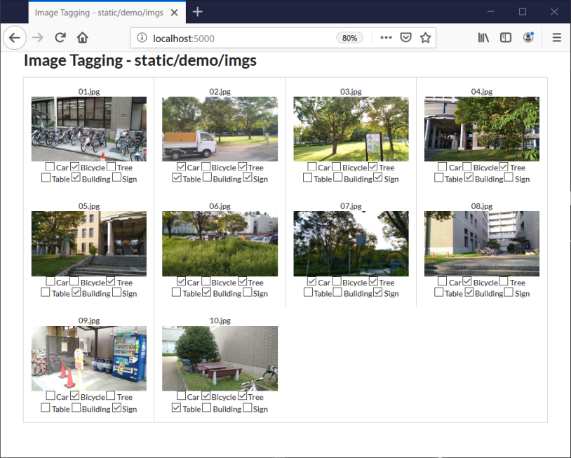

# Image Tagging Application #


## Prepare ##
1. Install packages

    pip install flask waitress toml sqlalchemy

2. Put image files in `static/imgs`
3. Edit config file `settings.toml`

## Run ##

```sh
python app.py
```

Open localhost:5000 in a web browser.

## Demo ##

```sh
python app.py --settings static/demo/settings.toml
# or below to use sqlite. still buggy
python app.py --settings static/demo/settings_sqlite.toml
```

Add `--open` option to the command to open the web browser.


# Settings

## Toml file example
```toml
img_dir = 'imgs' # image containing directory
tag_dir = 'tags' # tag text files containing directory
# tag_dir = 'tags.sqlite3' # sqlite3 database filename 
tags = ['Car','Bicycle','Tree','Table','Building','Sign'] # Possible tags
multilabel = true # allow multiple tags for a image
# multilabel = false # only one tag for a image

[server]
host = 'localhost'
port = 5000
threads = 10
```

# Dataformat

## Text
Text files with newline-separated tags

## Sqlite3
Table named `records` with the following columns.

- `key`: Image filename
- `data`: comma-separated tags